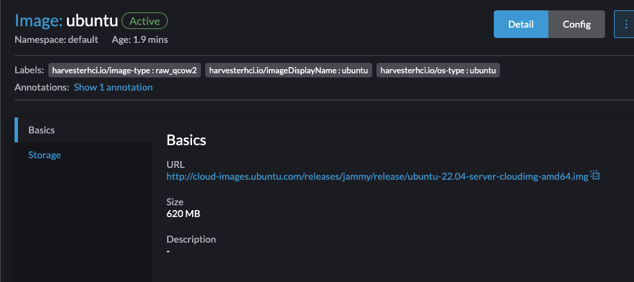
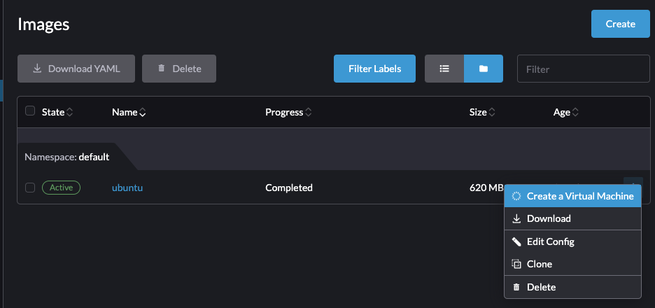

# Affinity Options on Harvester

This will be a brief readme explaining how a few specific features work with Harvester's implementation of Kubevirt and how you can try them for yourself. Much of these features will be available with UI elements within the 1.4 release coming October 2024.

## Requirements
You'll need a few common Kubernetes tools and things to pull this off:
* kubectl
* Harvester 1.3 installed somewhere, know the admin password and the VIP.

You'll need to enable feature gates in Kubevirt to take advantage of NUMA.

## Kubeconfig and Feature Gates
Create a local copy of your Harvester kubeconfig by using the [prep.sh](./prep.sh) script or skip if you already have your harvester kubeconfig set:
```console
$ ./prep.sh --vip 10.10.0.20 --password mypassword
Set your KUBCONFIG environment variable:
export KUBECONFIG=/home/deathstar/affinity_on_harvester/config
```bash
export KUBECONFIG=/home/deathstar/affinity_on_harvester/config
```

Following the directions here I set KUBECONFIG and verify my harvester cluster is there:
```console
$ export KUBECONFIG=/home/deathstar/affinity_on_harvester/config
$ kubectl get nodes
NAME       STATUS   ROLES                       AGE   VERSION
workshop   Ready    control-plane,etcd,master   31m   v1.27.10+rke2r1
```

Next I need to enable the feature gate. I can either manually edit it directly or run the script. Here's how you edit manually:
```bash
kubectl edit kubevirt kubevirt -n harvester-system
```

I'm looking specifically for these lines describing the currently enabled feature gates, these are the defaults out of the box, yours should look like this unless already modified.
```yaml
spec:
  certificateRotateStrategy: {}
  configuration:
    developerConfiguration:
      featureGates:
      - LiveMigration
      - HotplugVolumes
      - HostDevices
      - GPU
```

I need to add the specific enumerations to highlight that I want NUMA enabled. So I add `NUMA` and `CPUManager` to the end of this list
```yaml
spec:
  certificateRotateStrategy: {}
  configuration:
    developerConfiguration:
      featureGates:
      - LiveMigration
      - HotplugVolumes
      - HostDevices
      - GPU
      - NUMA
      - CPUManager
```

Alternatively, I can use the enable_features.sh script:

```console
$ ./enable_features.sh 
Enabling CPU Manager and NUMA feature gates
Warning: feature gate LiveMigration is deprecated, therefore it can be safely removed and is redundant. For more info, please look at: https://github.com/kubevirt/kubevirt/blob/main/docs/deprecation.md
kubevirt.kubevirt.io/kubevirt patched
Warning: feature gate LiveMigration is deprecated, therefore it can be safely removed and is redundant. For more info, please look at: https://github.com/kubevirt/kubevirt/blob/main/docs/deprecation.md
kubevirt.kubevirt.io/kubevirt patched
```


## CPU Pinning using CPU Manager
The kubevirt docs around CPU Manager are [here](https://kubevirt.io/user-guide/virtual_machines/dedicated_cpu_resources/). There's a good bit of gotchas in there to be aware of.

Pinning CPU resources in Harvester/Kubevirt works the same as it does in general Kubernetes. Kubevirt helps ensure the KVM instance gets to take advantage of it and also offers ways to isolate all kvm/qemu processes into a seperate CPU instance and not running in the VMI. 

For now, we're going to keep things simple. I've created a simple Ubuntu VM image in my Harvester deploymen. Feel free to use the same url: `http://cloud-images.ubuntu.com/releases/jammy/release/ubuntu-22.04-server-cloudimg-amd64.img`



### RKE2 and CPU Manager Policies

Enabling CPU pinning for the VM is very simple, it only requires a small modification to the `VirtualMachine` yaml definition. Enabling it at the Harvester level requires using a static policy for Kubernetes to always set aside reserved CPUs on your Harvester nodes that can run dedicated CPU workloads. 

#### Setting the Static Policy

As part of static policy, Kubernetes is instructed to set aside reserved CPUs on your Harvester nodes in order to run dedicated CPU workloads. This requires adding kubelet-args to your RKE2 instance on Harvester as well as a cleanup step when Harvester reboots. Given how the Elemental OS layer is immutable, changes to the core functions like the kubelet need to be edited in a specific place. Do this on every node you wish to enable dedicated CPU pinning on.

SSH into the node and hop into the superuser context:
```console
$ ssh rancher@10.10.0.16
(rancher@10.10.0.16) Password: 
Last login: Fri May 17 17:55:35 2024 from 10.10.0.50
rancher@workshop:~> sudo su
workshop:/home/rancher # 
```

There is a `90-harvester-server.yaml` and `90-harvester-agent.yaml` entry in `/oem/90_custom.yaml`. On each boot, these files are generated at boot time. Go to the `kubelet-args` fields in each and add the below elements. We will be reserving 2 cores for dedicated CPU resources here. This number will matter later when we create a VM. We are also setting the policy state to `static` as opposed to default. There's a lot of reading material for Kubernetes cpu-manager for this, but I wanted to highlight a case where we are setting aside dedicated cores for specific worklodas as opposed to Kubernetes automatically choosing for us.

```yaml
- "cpu-manager-policy=static"
- "cpu-manager-policy-options=full-pcpus-only=true"
- "cpu-manager-reconcile-period=0s"
- "reserved-cpus=2"
```

When the node reboots, the static CPUs need to be cleared. So adding a removal command to the initramfs stage of the boot needs to be done. Open `/oem/90_custom.yaml` again. And on the first few lines, add a new command to the existing list under `initramfs`:

Add the `rm /var/lib/kubelet/cpu_manager_state || true` line to the field:
```yaml
stages:
    initramfs:
        - commands:
          - modprobe kvm
          - modprobe vhost_net
          - sed -i 's/^NETCONFIG_DNS_STATIC_SERVERS.*/NETCONFIG_DNS_STATIC_SERVERS="10.10.0.1"/' /etc/sysconfig/network/config
          - rm /var/lib/kubelet/cpu_manager_state || true
```

Save the file. Now reboot your node:
```console
workshop:/home/rancher # exit
exit
rancher@workshop:~> sudo reboot now; exit
Terminated
logout
Connection to 10.10.0.16 closed.
```

Before running any VMs, you can verify that your CPU manager mode is set to static and has no CPUs actively being used:

```console
workshop:/home/rancher # cat /var/lib/kubelet/cpu_manager_state 
{"policyName":"static","defaultCpuSet":"0-19","checksum":31209605}
```

### Running the VM

After my Harvester cluster has come up, I'll create a VM with the VM image: 


Recall that above we have reserved 2 CPU cores for dedicated usage. So I'll build a VM with 2 CPU and 4GB of memory, I bumped the disk image to 20GB. I am using my untagged VM Network to keep it simple. I also ensured the guest agent was enabled since Ubuntu does not come with `qemu-guest-agent` by default and enabled secure boot and UEFI. Go ahead and create the VM by clicking the `Create` button. Wait a few seconds for the VM object to stabilize and then stop the VM. Wait until it is in an 'Off' position.

Harvester is awesome in that much of the complexity of Kubevirt is removed but does so at the cost of some hooks/validators being applied to some kubevirt data types. The `VirtualMachine` CRD is a great example and one that affects our ability to create. So what we're going to focus on is the few items that we need to add. 

I need to set `dedicatedCpuPlacement: true` as a new entry for the `domain.cpu` configuration in my VM. I also need to set the `resources.requests.memory` field to `4Gi`. A snippet of what this looks like:
```yaml
domain:
  cpu:
    cores: 2
    dedicatedCpuPlacement: true
    sockets: 1
    threads: 1
  resources:
    limits:
      memory: 4Gi
    requests:
      memory: 4Gi
```

Once that is added, I click `Save`. If everything goes well, the VM will start up and run on top of the dedicated CPUs.

You can verify that CPUs have been carved off by looking at the kubelet cpu-manager state file:

```console
workshop:/home/rancher # cat /var/lib/kubelet/cpu_manager_state 
{"policyName":"static","defaultCpuSet":"0-1,4-19","entries":{"5e2cd290-38d7-4749-9218-dfe7132d86df":{"compute":"2-3"}},"checksum":2779859136}
```

#### Notes about Automation
Automating the above is tricky. Harvester has mutating hooks that automatically modify the resource requests in a `VirtualMachine` object. So when either applying a `VirtualMachine` object via the UI or via yaml and the Kubernetes API, Harvester attempts to modify the value. The above steps work because we are patching the value after it has been created.

Automating will require following this pattern and using a `kubectl patch` operation to make the changes necessary post-creation. Once Harvester 1.4 is released, this will no longer be the case.

## Direct CPU pass-through with NUMA on Harvester
If the above steps have been followed, NUMA pass through can be enabled by enabling hugepages on your nodes that support NUMA and then editing the VM we created and adding the pass-through flags. NUMA documentation can be [found here](https://kubevirt.io/user-guide/virtual_machines/numa/).

### Hugepages
For `NUMA` to work properly, we need to enable hugepages. There are some requirements around creating these. But assuming you did not provision these in your Harvester install via config yaml and used a normal UI-driven installation, you'll need to enable them on the node.

SSH into the node and hop into the superuser context:
```console
$ ssh rancher@10.10.0.16
(rancher@10.10.0.16) Password: 
Last login: Fri May 17 17:55:35 2024 from 10.10.0.50
rancher@workshop:~> sudo su
workshop:/home/rancher # 
```

Enabling hugepages to save through reboots requires working through Elemental OS's immutable layer just like the advanced version of CPU pinning. Open `/oem/90_custom.yaml` again. And on the first few lines, add a new command to the existing list under `initramfs`:

Add the `sysctl -w vm.nr_hugepages=4196` line to the field, don't remove any lines there especially if you followed the advanced steps for CPU pinning. This sets the number of hugepages on the node to 4196. The pages are 2Mi in size (2048kb) yielding 8Gi of available hugepage-dedicated memory. We will only need 4Gi of this since our VM is small. Keep in mind this memory slice will take away from the available memory that RKE2 has to run, so if done on a small machine with less memory, you could impact the performance of the OS greatly. It is recommended to do this on a system with 64Gi or more.

```yaml
stages:
    initramfs:
        - commands:
          - modprobe kvm
          - modprobe vhost_net
          - sed -i 's/^NETCONFIG_DNS_STATIC_SERVERS.*/NETCONFIG_DNS_STATIC_SERVERS="10.10.0.1"/' /etc/sysconfig/network/config
          - sysctl -w vm.nr_hugepages=4196
```

### Enabling NUMA
Edit the Yaml in the Harvester UI for the VM we just created, we need to change two things:

Add the `guestMappingPassthrough` field, it should look like this:
```yaml
domain:
  cpu:
    cores: 2
    dedicatedCpuPlacement: true
    numa:
      guestMappingPassthrough: { }
```

Follow by editing the memory to use `hugepages` instead of regular memory, remove the `guest` line and replace it with `hugepages`:
```yaml
domain:
  memory:
    hugepages:
      pageSize: 2Mi
```

Start the VM now. Once it gets to a running state, you can verify that hugepages are now being allocated on the node your VM is running upon:

```console
$ kubectl describe nodes
...
Allocatable:
  cpu:                            19
  devices.kubevirt.io/kvm:        1k
  devices.kubevirt.io/tun:        1k
  devices.kubevirt.io/vhost-net:  1k
  ephemeral-storage:              149527126718
  hugepages-1Gi:                  0
  hugepages-2Mi:                  8392Mi
  memory:                         56958528Ki
  pods:                           200
...
Allocated resources:
  (Total limits may be over 100 percent, i.e., overcommitted.)
  Resource                       Requests         Limits
  --------                       --------         ------
  cpu                            6815m (35%)      8215m (43%)
  memory                         5649958657 (9%)  9356674817 (16%)
  ephemeral-storage              50M (0%)         0 (0%)
  hugepages-1Gi                  0 (0%)           0 (0%)
  hugepages-2Mi                  4Gi (48%)        4Gi (48%)
  devices.kubevirt.io/kvm        1                1
  devices.kubevirt.io/tun        1                1
  devices.kubevirt.io/vhost-net  1                1
```


## Real-Time workloads with NUMA on Harvester

While theoretically possible with the above settings, the RT Linux kernel extensions must be addeded in order to support real time processes. At this point in time, that is not possible. However, custom builds of Harvester are certainly possible and are already being issued, including the FIPS 140-2 build which requires the FIPS extensions in SLE Micro.

If there is a need for RT execution, that can be added as a feature in the future.